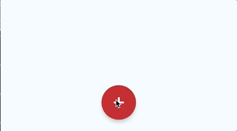

# 100 Days Of Code - Log

### Day 13: January 15, 2017
**Today's Progress**: 
* Cleaned code from yesterday and commited the progress to GitHub
* Introduced a simple "API" to temporarily store activities and provide an interface to fetch / add / update activities. 
(The temporary storage part will be replaced with a permanent local storage soon)
* Changed "Add activity" scene to provide input fields. These input fields will be replaced by better controls soon to reduce
the amount of data the user has to type in when adding a new activity.

### Day 12: January 14, 2017
**Today's Progress**: 
* Solved problem from yesterday - Floating Action Button is on the right spot now
* Created a custom TabBar for the react-native-scrollable-tab-view with Icons - this one was a little bit tricky first,
but worked out in the end.

Tomorrow I want to clean the code and check in the current solution. Afterwards I will focus on the add functionality
and kind of a local data storage.

### Day 11: January 13, 2017
    
**Today's Progress**: 
* Added a tabbed view for the main scenes. Here are the components I tried:
  * [react-native-tab-view](https://github.com/react-native-community/react-native-tab-view): I liked it because of the
  smooth animations and the possibility to switch the tab bar between the top and the bottom (read about this in "thoughts") 
  * [react-native-scrollable-tab-view](https://github.com/skv-headless/react-native-scrollable-tab-view): I think I stick with it 
  because it is easier to use (less code) and it should fit my needs. We will see when it comes to icons in the tab bar.  
* Replaced the AddButton Component with [react-native-action-button](https://github.com/mastermoo/react-native-action-button)
which is a fully functional "Floating Action Button" which is compliant to the Material Design Guidelines.
* Decided to use [react-native-vector-icons](https://github.com/oblador/react-native-vector-icons) because it is cross platform 
compatible and it consists of a bunch of awesome icons.

**Thoughts:** Today I spent much time on trying tab bars and reading the [Material Design Guidelines](https://material.io/guidelines/components/bottom-navigation.html).
The latter was also the reason why I changed the tab bar to the bottom. According to the guidelines, bottom navigation
is the preferred navigation pattern between top-level scenes. On the contrary, tabs are used to group content into different views.
While I tried to find a control for a bottom navigation bar, I found out that a tab bar at the bottom will do the job.
During my research I also found another tab control, which I tested afterwards.

I won't check in my work today. It is not finished and I am still facing issues:
* I'm not sure which tab control suits best
* I did not find out how to combine the Floating Action Button correctly with a Bottom Navigation Bar: 
According to the guidelines, the Bottom Navigation Bar has to have 56dp height. The FAB seems to have an offset
of 30dp from the bottom end of the screen. I'm not sure if it is okay to increase the offset to stay above the control, but that's 
something for tomorrow.

**Link to work:** Since I did not check in, just a giphy [Screen Video](http://www.giphy.com/gifs/l3q2FvS4gnKakJMDS)

### Day 10: January 12, 2017
    
**Today's Progress**: 
* Added Navigator to provide functionality to change scenes (Screens/Pages are called scenes in React Native)
* Added placeholder Components for "Statistics" and "Add new Activity"
* Built navigation routes between the three scenes.
 
**Thoughts:** Took me some time to understand how Navigator is working but in the end it was quite easy 
for my basic routes. 
I had some help from a very good blog post on [Medium](https://medium.com/react-native-training/react-native-navigator-navigating-like-a-pro-in-react-native-3cb1b6dc1e30#.jvy9qjbpp)
where I could find everything I needed. Tomorrow I will replace the blue buttons with a navigation bar. I just put the 
buttons in because I wanted to test it as quick as possible. 

**Link to work:** 
* [WorkoutLog](https://github.com/areiterer/wolo)
* [See it in action](http://www.giphy.com/gifs/l3q2Rnk6bdvAzJ7KU)

### Day 9: January 11, 2017
    
**Today's Progress**: 
* Added an "Add Activity" button - similar to the one I created yesterday - to the app. Since I just need one add 
function, it does not display more buttons on click. Instead it just calls a passed function.
* Did some recherche for React Natives Navigator. 
 
**Thoughts:** Today there was not much outcome to show because I spent more time on recherche for the Navigator.
It is necessary to display different Screens (or "Scenes") and it behaves different to the Router I know from React.
Navigator keeps a stack of Scenes which are pushed and popped - I found out how to do this, but I still don't know 
how to define a different Scene to be rendered. Tomorrow I want to finish the Add-Scene - this means I have to find
out how to push the "Add" Scene to the stack and render the form.  

**Link to work:** [WorkoutLog](https://github.com/areiterer/wolo)

### Day 8: January 10, 2017
    
**Today's Progress**: 
* More work on the design of Wolo - still on paper. I want to have an idea of how all the screens look like and which 
functionality they provide. Also I want to get an overview of all possible transitions between the screens.
* Created a sample app with react native to rebuild the "Add" button from the google mail / google calendar app. 

* Started with coding the screen for the activity history. Learned much about ListView and flex when styling the basic 
design.

**Link to work:** [WorkoutLog](https://github.com/areiterer/wolo)

### Day 7: January 9, 2017
    
**Today's Progress**: 
* Decision to develop a Workout Logging App with React Native
* Worked on the requirements
* Initiated a react project and set up a new GIT project
* Tested and tried React Native and debugging on the smart phone
* Played around with the [KitchenSink](https://github.com/GeekyAnts/NativeBase-KitchenSink) app from [NativeBase](http://nativebase.io/) 
* Started to build a new button component - will check this in separately as soon as I can show something.

**Link to work:** [WorkoutLog](https://github.com/areiterer/wolo)

### Day 6: January 8, 2017
    
**Today's Progress**: 
* Played around with CSS until I got a useful design for mobile and desktop UI
* background color changes by cloudyness (provided by OpenWeatherMap API)
* weather icon changes depending on the weather - used [Meteocons](http://www.alessioatzeni.com/meteocons/) for that.

**Thoughts:** I really suck in designing things :) But slowly I get a feeling where to get ideas from and how to build semi
good looking UI without being a graphics designer. 
At this point I label the WeatherMeter project as finished but will work on it for improvements or extensions if something 
comes to my mind.

At this point I try to find a new project for the next days - maybe something with React Native and a NodeJS backend.

**Link to work:** [WeatherMeter](https://github.com/areiterer/react-weathermeter)

### Day 5: January 7, 2017
    
**Today's Progress**: 
Added Bootstrap to WeatherMeter and tried to get everything in a nice shape - well this did not work out like I
wanted it to. So I will have to work on it again tomorrow. 

**Thoughts:** I am really bad at designing things - but I want to finish WeatherMeter with a quite good design - 
 so I may put a little bit more effort in it than I planned to do. 

### Day 4: January 6, 2017
    
**Today's Progress**: 
* Added a input field for specific location search
* Added Values for wind speed, humidity and air pressure
* Changed labels for min/max temperature, humidity, air pressure and wind speed to icons

**Thoughts:** The app is still ugly but the main functionality is almost finished now. Next steps will be 
the big icon for the current weather state and overall styling. 

**Link to work:** [WeatherMeter](https://github.com/areiterer/react-weathermeter)

### Day 3: January 5, 2017
    
**Today's Progress**: 
Since I found no time slot for a quiet hour of coding on the WeatherApp, I decided to do some Codewars during my 
morning and evening commute. Since I go to work by train for ~40 minutes per direction, there is at least the possibility
to stay on track by completing some challenges there.

**Thoughts:** I really like codewars - especially because you can compare your code to the solutions of other coders as 
soon as you finished a kata.
 

### Day 2: January 4, 2017

**Today's Progress**: 
This day I refactored the WeatherData component to take every single piece of information as a separate prop.
I did this because this way I can make the WeatherData component as pure and predictable as possible.

Also, I put some logic into the root "App" component to retrieve the current geolocation and fetch the current weather 
data from OpenWeatherMap.

**Thoughts:** Today's tasks were pretty straight forward. I still did not spend any time on design or styling - I want at least finish the basic functionality
first, so that I can find the right position for every piece of information I want to show.

As my next steps I plan to 
* add a input field so that users can enter different locations
* display humidity, wind speed, air pressure, etc.
* introduce icons instead of the labels
* add a big icon somewhere to display the current weather

**Link to work:** [WeatherMeter](https://github.com/areiterer/react-weathermeter)

### Day 1: January 3, 2017

**Today's Progress**: 
I started with the FreeCodeCamp "Show the Local Weather" project as my first project of this challenge.
At the moment, it just shows sample data. I added some test data from the API and a overall component which shows the 
name of the city and the temperature.
This will be refactored soon, as it is just my starting point.

**Thoughts:** I first tried to do this in CodePen - since it's a FreeCodeCamp project, but I soon decided to work locally 
and storing my progress on GitHub because I may want to extend the app later on and get a folder architecture I am more used to.

**Link to work:** [WeatherMeter](https://github.com/areiterer/react-weathermeter)

